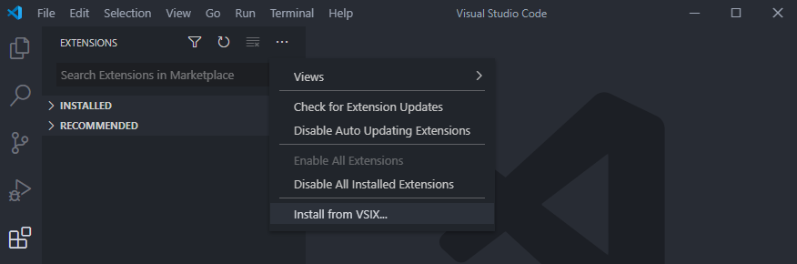
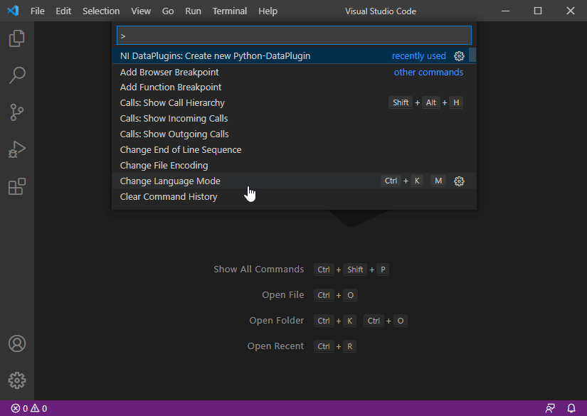

# NI DataPlugins Extension for Visual Studio Code

A [Visual Studio Code](https://code.visualstudio.com/) extension that provides development support for [NI DataPlugins](https://www.ni.com/downloads/dataplugins) written in [Python](https://www.python.org). For more information about writing Python DataPlugins, please refer to the [SystemLink Operations Handbook](https://operations.systemlink.io/python-dataplugins/python-dataplugins).


## Quick Start

**Step 1.** Install this extension. Download the latest *vsix* from [Release](https://github.com/jschumme/vscode-ni-python-dataplugins/releases).

- Open Visual Studio Code and select __View__->__Extensions__ from the menu to display the __Extensions__ pane.
- Click the __...__ in the top-right corner of the __Extensions__ pane and select __Install from VSIX__.
- Locate the .vsix file you download and click __Open__.
- Click __Restart__ to confirm.



**Step 2.** Create a new DataPlugin. Launch __VSCode Command Palette__ (Ctrl+Shift+P), paste the command below, and press __Enter__.

```json
NI DataPlugins: Create new Python-DataPlugin
```



**Step 3.** Export the DataPlugin. Right-click the \*.py file you want to export. 
- __NI DataPlugins: Export DataPlugin__: This option is recommended when you want to publish your DataPlugin and make it available to other people. Your code will be embedded in the exchange file.
- __NI DataPlugins: Register DataPlugin for Development__: This option registers the DataPlugin inplace and can only be used on your development machine. You will be able to test your code changes directly in DIAdem, LabVIEW or SystemLink.

## Advanced Settings

### Custom Template

Start writing your DataPlugin with your own custom template. Simply add your template to the `examples` directory. You find the example folder at `$HOME/.vscode/extensions/vscode-ni-python-dataplugins` under Mac and Linux or at `%USERPROFILE%\.vscode\extensions` folder under Windows.

### .file-extensions

Create a file `.file-extensions` in the root directory of your project and list all file extensions that you want your DataPlugin to support. If no list is defined, you will be prompted to provide a list of file extensions when you export your DataPlugin.

### Export Path

Set the export path for all your plugins in __Preferences -> Settings -> Extensions -> Vscode-NI-Python-DataPlugins -> Plugin Export Path__. The path can be a folder or a *.uri file.

<details>
<summary>Example</summary>

```json
{
    "NI-DataPlugins.PluginExportPath": "C:\\Temp"
}
// OR
{
    "NI-DataPlugins.PluginExportPath": "C:\\Temp\\MyPlugin.uri"
}
```

</details>

## Contribute

Contribute to this project by finding issues, requesting features or creating Pull Requests. General documentation about developing extensions for Visual Studio Code can be found [here](https://code.visualstudio.com/api) and [here](https://vscode-docs.readthedocs.io/en/stable/extensions/debugging-extensions/).

### Developer Setup

To compile this extension, run:

```sh
git clone https://github.com/ni/vscode-ni-python-dataplugins.git
cd vscode-ni-python-dataplugins
npm install
```

To test your changes, run:

```sh
npm run lint
npm run test
npm run test:e2e
```

Run the extension from VSCode by pressing `F5`.

## License

See [LICENSE](https://github.com/ni/vscode-ni-python-dataplugins/blob/master/LICENSE) for details about how this extension is licensed.
